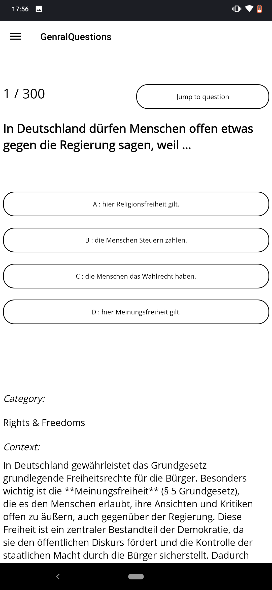
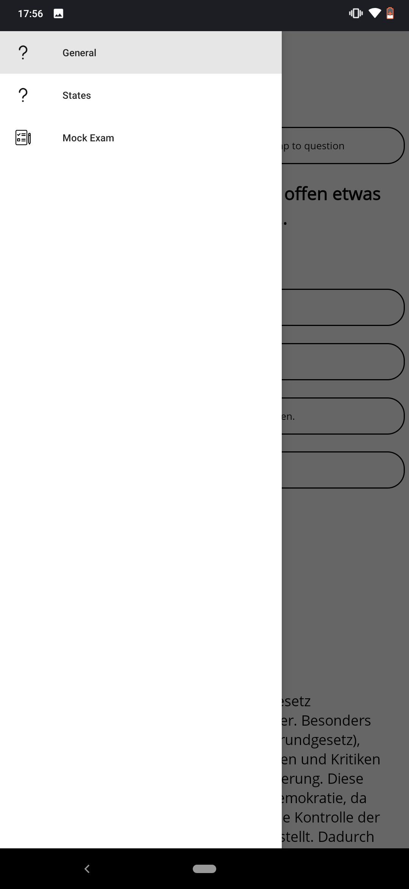

# Introduction

The Leben in Deutschland / Eiburgerung test can prove that you know the legal and social system and living conditions in Germany. This program is an offline Android application designed to help users prepare for the exam.

## Sample Views

|  | |
| ------- | --- |

## Gettin Started

The application is built using dotnet MAUI Andriod 9.0 workload. To package and run the application privately, please ensure:

- Dotnet MAUI Andriod 9.0 workload.
- Dotnet SDK, Runtime 9 installed.
- Open JDK 11 installed.
- Andriod studio (Optional).

Clone the repository, navigate to the application directory, open it in your IDE, and run the app on a virtual or physical Android device.

[Microsoft cli build](https://learn.microsoft.com/en-us/dotnet/maui/android/deployment/publish-cli?view=net-maui-9.0) has a good documentation on how to build abb / apk files.

Will like to extend thanks to [Manish Tiwari](https://github.com/leben-in-deutschland/leben-in-deutschland-app). The application questions are sourced from the user.
